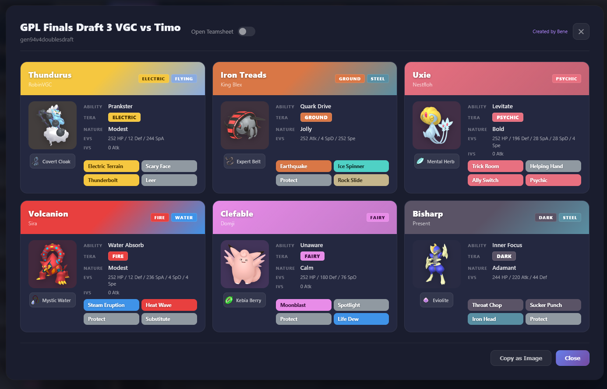
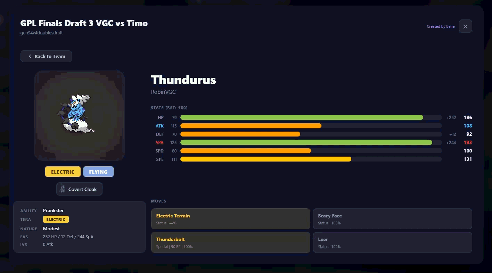

# Pokemon Showdown Teambuilder Beautify

A userscript / Chrome extension that adds a beautiful teamsheet overlay to the [Pokemon Showdown](https://play.pokemonshowdown.com/) teambuilder.

## Screenshots





## Features

- Dark-themed teamsheet overlay with styled cards for each Pokemon
- Animated Gen 5 sprites with pixelated upscaling
- Type badges, item icons, and ability/nature/EV info
- Computed stat bars (base + IV + EV + nature) with nature highlighting (red = boosted, blue = reduced)
- Detail view: click any Pokemon card for a full breakdown with large sprite, stat bars, and move details
- **Open Teamsheet** toggle: switch to a simplified view that hides natures, EVs, IVs, and stat bars — perfect for sharing without revealing competitive details
- Copy as image / close controls
- Works with all team formats and generations

## Installation

### Option 1: Tampermonkey (recommended)

1. Install [Tampermonkey](https://www.tampermonkey.net/) for your browser
2. Open `teambuilder-beautify.user.js` and click "Install" in Tampermonkey, or:
   - Open Tampermonkey dashboard -> Utilities -> Import from file -> select `teambuilder-beautify.user.js`
3. Navigate to [Pokemon Showdown](https://play.pokemonshowdown.com/) and open the Teambuilder
4. Edit any team and click the **Teamsheet** button in the toolbar

### Option 2: Chrome Extension (unpacked)

1. Build the extension:
   ```bash
   node build.js
   ```
2. Open Chrome and go to `chrome://extensions/`
3. Enable **Developer mode** (top right)
4. Click **Load unpacked** and select the `chrome-extension/` folder
5. Navigate to [Pokemon Showdown](https://play.pokemonshowdown.com/) and use the Teambuilder as above

## Usage

1. Open the Teambuilder on Pokemon Showdown
2. Select and edit a team
3. Click the **Teamsheet** button that appears in the team toolbar
4. Browse your team in the grid view, or click any Pokemon for a detailed breakdown
5. Use **Copy as Image** to export the teamsheet

## Project Structure

```
teambuilder-beautify.user.js   # Main userscript (Tampermonkey)
build.js                        # Build script: strips userscript header for Chrome extension
chrome-extension/
  manifest.json                 # Chrome MV3 manifest
  teambuilder-beautify.js       # Generated from build.js (do not edit directly)
```

## Releases

Releases are built automatically via GitHub Actions on every push to `master`. Each release includes:

- `teambuilder-beautify.user.js` — ready to install in Tampermonkey
- `chrome-extension.zip` — ready to unzip and load as an unpacked Chrome extension

Download the latest release from the [Releases page](../../releases).

## Development

Edit `teambuilder-beautify.user.js` directly. After making changes:

- **Tampermonkey**: Changes apply on page reload (if using file access) or re-import the script
- **Chrome Extension**: Run `node build.js` then reload the extension in `chrome://extensions/`
